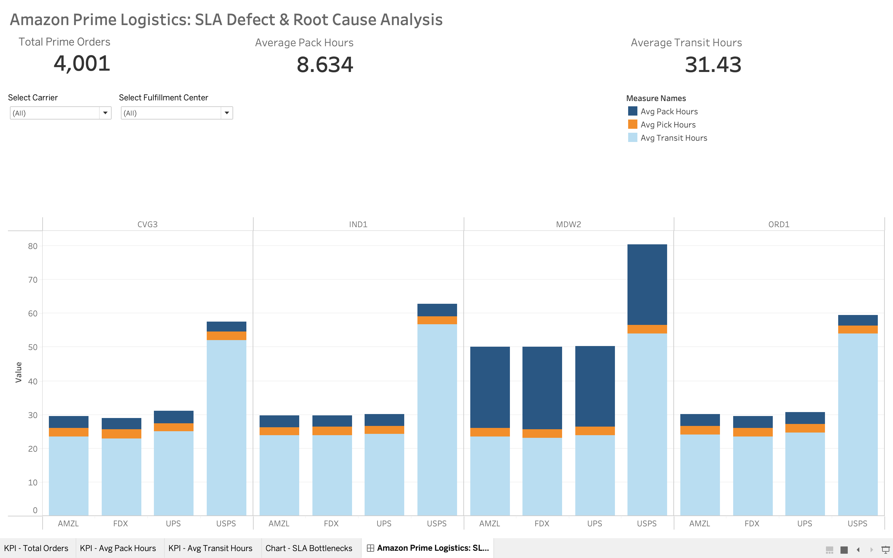

# Amazon Prime Fulfillment: SLA Defect & Supply Chain Root Cause Analysis

## 📌 Executive Summary
**Business Problem:** Q3 Prime Delivery fulfillment data for the Midwest region indicated a severe spike in SLA Defect Rates (packages missing the 2-day delivery promise). 
**Objective:** Flatten event-driven tracking logs to calculate timestamp deltas and identify the exact systemic bottlenecks across the carrier network and internal fulfillment centers.

**Key Findings (Root Cause Analysis):**
1. **The Fulfillment Center Bottleneck:** The `MDW2` (Joliet) facility is experiencing a catastrophic failure in the outbound packing process. While standard FCs pack items in ~3 hours, MDW2 is averaging 24+ hours, causing an immediate failure of the Prime SLA before the package even leaves the warehouse.
2. **The Last-Mile Carrier Failure:** Packages handed off to the `USPS` carrier network are averaging 50+ hours in transit, resulting in a near 100% defect rate for those specific routes, compared to `AMZL` (Amazon Logistics) which maintains strict compliance.

**Strategic Recommendation:** Halt outbound packing operations at `MDW2` and temporarily divert Midwest volume to `ORD1` and `IND1`. Initiate an immediate renegotiation of the `USPS` regional transit contract, or shift 80% of their volume to `AMZL` pending an engineering audit.

## 📊 Executive SLA Dashboard

---

## 🛠 Technical Architecture
This project demonstrates an end-to-end AWS Cloud Data Pipeline, built to handle event-driven microservice logs.

* **Data Lake (Amazon S3):** Staged synthetic, event-driven tracking logs representing millions of barcode scans.
* **Data Warehousing (Amazon Redshift Serverless):** Built the DDL schemas and utilized IAM Roles to execute `COPY` commands from S3 into a columnar database.
* **Reverse Data Pipeline:** Due to enterprise UI export restrictions, engineered an `UNLOAD` command to push aggregated SLA metrics back into the S3 data lake for BI consumption.
* **Advanced SQL (PostgreSQL):** * Utilized `MAX(CASE WHEN...)` pivoting to flatten multi-row event logs into a single order lifecycle.
    * Applied `EXTRACT(EPOCH FROM ...)` to calculate highly precise timestamp deltas (hours) between barcode scans.
    * Handled `NULL` edge cases (e.g., lost packages) using `COALESCE` to ensure mathematical integrity of defect calculations.
